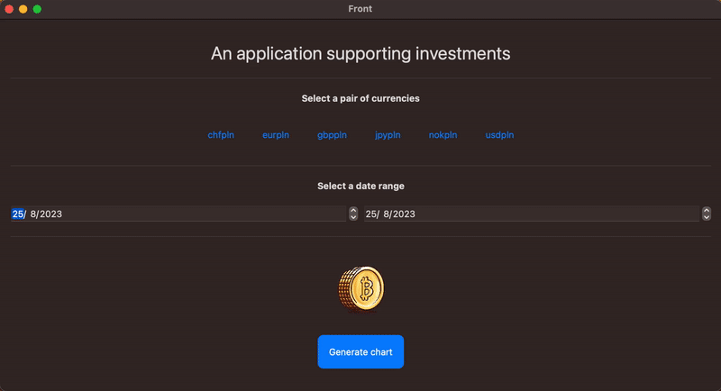

# Currency_prediction [Early Demo]

## Exchange rates come from https://stooq.pl

### Configure the variables in the file <a href="https://github.com/przemek890/Currency_prediction/blob/master/Front/Front_Main/Front/Variables.swift#L11-L14">Variables</a> accordingly:
> System shell used: <a href="https://github.com/przemek890/Currency_prediction/blob/master/Front/Front_Main/Front/Python.swift#L5">shell</a>

> Currency pairs to choose from: <a href="https://github.com/przemek890/Currency_prediction/blob/master/Front/Front_Main/Front/ContentView.swift#L3">currency_pairs</a>

> Currency prediction path: <a href="https://github.com/przemek890/Currency_prediction/blob/master/Front/Front_Main/Front/Python.swift#L10">currency_prediction_path</a>

> Path to python in virtual environment: <a href="https://github.com/przemek890/Currency_prediction/blob/master/Front/Front_Main/Front/Python.swift#L8">venv_python_path</a>

> Path to swift.py file (don't change its location): <a href="https://github.com/przemek890/Currency_prediction/blob/master/Front/Front_Main/Front/Python.swift#L7">swiftpy_path</a>
